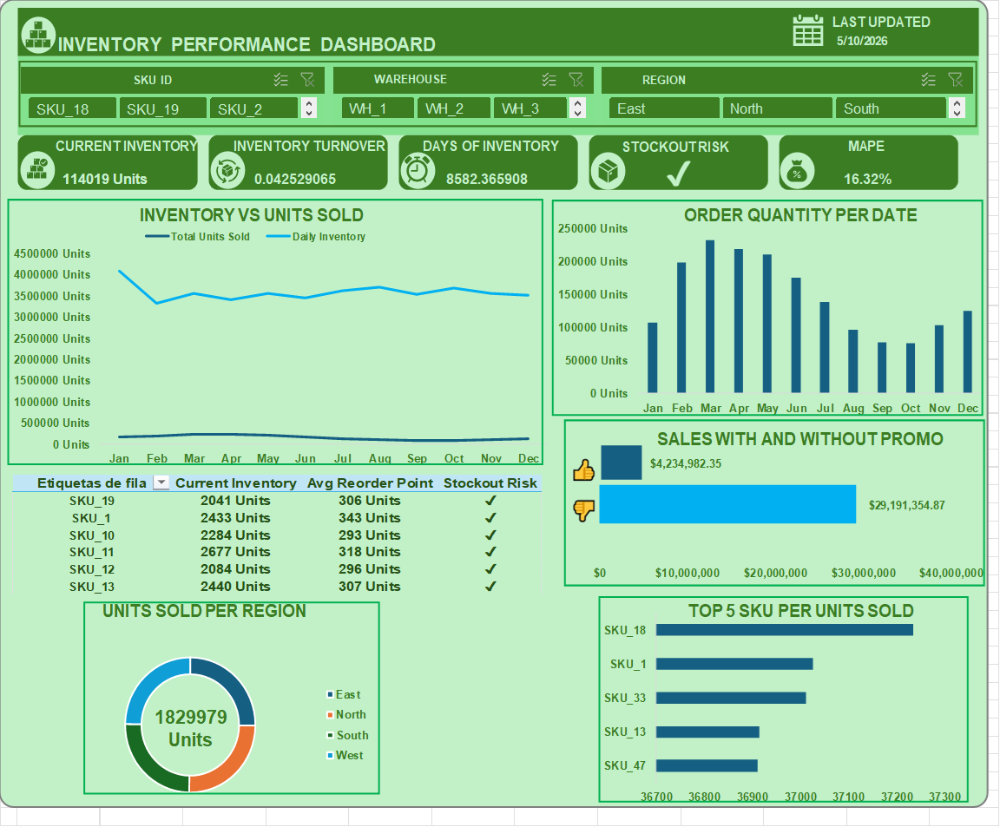
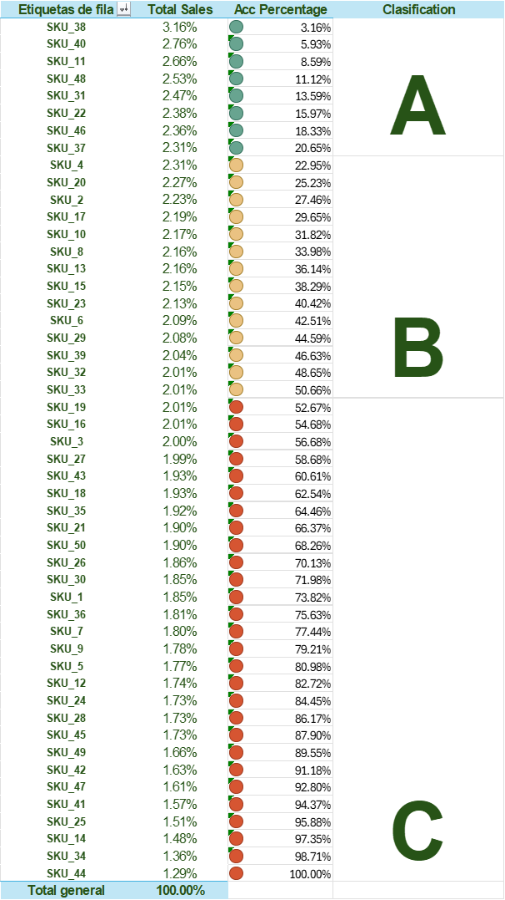

# 📊 Dashboard de Rendimiento de Inventarios

## 📌 Descripción del Proyecto
Este proyecto presenta un **Dashboard de Rendimiento de Inventarios** desarrollado en **Microsoft Excel utilizando Power Pivot**, enfocado en el análisis de datos para la toma de decisiones en entornos de **Supply Chain**.

El dashboard permite evaluar el estado del inventario, el desempeño de ventas y detectar ineficiencias operativas como **sobrestock y baja rotación**.

---

## 🖼️ Vista General del Dashboard



---

## 🧠 Clasificación ABC del Inventario



Se implementa una clasificación basada en el **porcentaje acumulado de ventas**:

| Categoría | Criterio | Interpretación |
|----------|--------|----------------|
| A | ≤ 20% acumulado | Productos críticos (alto impacto) |
| B | 20% – 50% | Importancia media |
| C | > 50% | Bajo impacto |

### ⚙️ Metodología
1. Ordenamiento de productos por ventas (descendente)  
2. Cálculo de porcentaje individual  
3. Cálculo de porcentaje acumulado  
4. Aplicación de formato condicional  

---

## 🚨 Hallazgos Clave del Análisis

### 📉 Baja Rotación de Inventario
El indicador de **Inventory Turnover (~0.04)** refleja una **rotación extremadamente baja**, lo que indica que los productos permanecen demasiado tiempo en almacenamiento.

---

### 📦 Sobreinventario (Overstock)
El alto nivel de inventario actual en comparación con las ventas evidencia un **exceso de stock**, lo que puede generar:

- Costos de almacenamiento elevados  
- Riesgo de obsolescencia  
- Ineficiencia operativa  

---

### 💰 Capital Inmovilizado
El inventario acumulado representa **dinero sin movimiento**, lo que impacta directamente:

- Flujo de caja  
- Rentabilidad del negocio  
- Capacidad de inversión  

---

### ⚠️ Riesgo Operativo
Aunque existe disponibilidad de productos, la mala gestión del inventario puede derivar en:

- Mala asignación de recursos  
- Desbalance entre oferta y demanda  

---

## 📊 Indicadores Clave (KPIs)

- Inventario Actual  
- Rotación de Inventario  
- Días de Inventario  
- Riesgo de Stockout  
- MAPE (precisión del pronóstico)  

---

## 📈 Visualizaciones Incluidas

- Inventario vs Unidades Vendidas  
- Cantidad de pedidos por fecha  
- Ventas con y sin promoción  
- Unidades vendidas por región  
- Top 5 productos  

---

## 🧮 Modelo de Datos

El modelo incluye:

- SKU_ID  
- Warehouse_ID  
- Supplier_ID  
- Región  
- Unidades vendidas  
- Nivel de inventario  
- Lead time  
- Punto de reorden  
- Cantidad de pedido  

### 📌 Ejemplo de medida (DAX)

```DAX
Product Ranking = 
RANKX(
    ALL(supply_chain_dataset1[SKU_ID]),
    [Total Units Sold],
    ,
    DESC,
    Dense
)
---

## 🛠 Herramientas Utilizadas

- Microsoft Excel  
- Power Pivot  
- Tablas dinámicas  
- Formato condicional  
- DAX  

---
## 💡 Valor del Proyecto

Este proyecto demuestra habilidades en:

- Análisis de datos aplicado a Supply Chain  
- Modelado de datos en Excel  
- Visualización de información  
- Identificación de problemas de negocio  
- Interpretación de KPIs  

---

## 🔮 Mejoras Futuras

- Integración con Power BI  
- Automatización de datos  
- Modelos de pronóstico más avanzados  
- Optimización del inventario (EOQ, Safety Stock)  

---

## 👨‍💻 Autor

**Roy Romero**  
Analista de Datos | Supply Chain | Business Intelligence  

---
